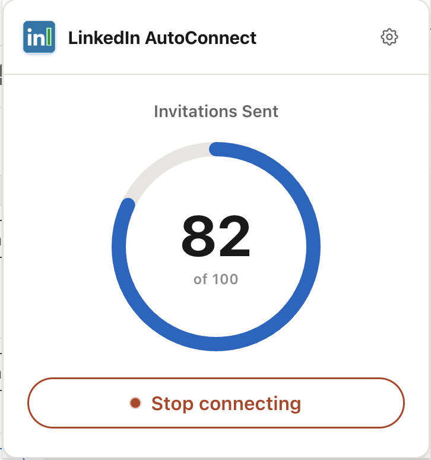

 

> [!WARNING]
> personally i don't recommend using this, not even a little bit. linkedin will most likely flag your account for spam and restrict it. you've been warned, proceed at your own risk ngl

Tired of manually clicking 'Connect' on LinkedIn? This extension does it for you automatically. 
 
 

1. Download `linkedin-autoconnect-chrome-extension.zip` from the [latest release](https://github.com/halitsever/linkedin-autoconnect-chrome-extension-fork/releases)
2. Unzip it — you'll see some folders along with the `manifest.json` file
3. Open Chrome, go to `chrome://extensions` and enable **Developer mode**
4. Click **Load unpacked** and select the unzipped folder
5. The extension is now loaded click the icon, pick a page, hit **Start**

To connect with specific people (e.g. recruiters from a company), click **Search People** in the popup, narrow your LinkedIn search, then hit **Start**.

  MIT License

